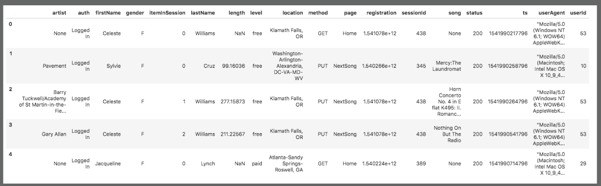
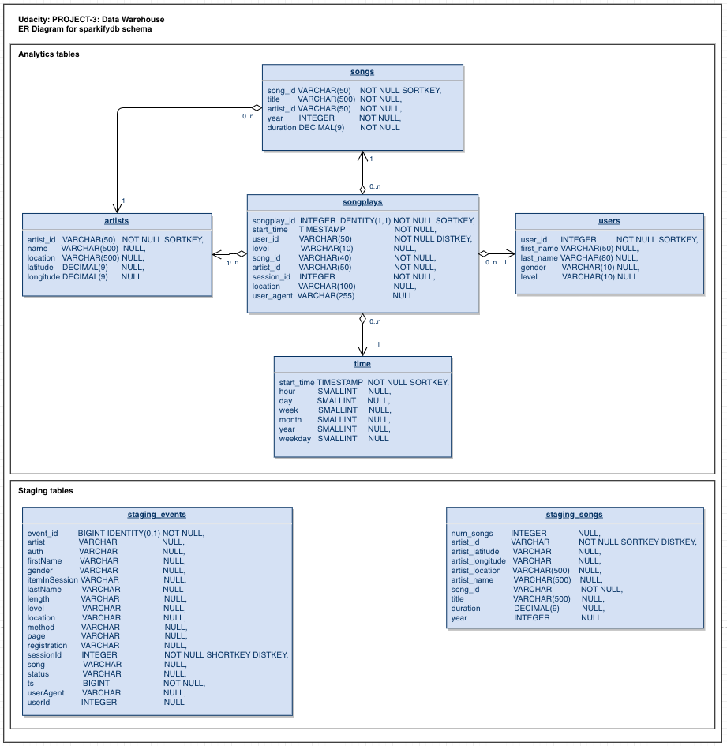

_(Udacity: Data Engineering Nano Degree) | jukka.kansanaho@gmail.com | 2019-05-04_
_This project is a part of [Udacity's Data Engineer Nano Degree](https://eu.udacity.com/course/data-engineer-nanodegree--nd027)._

# PROJECT-3: Data Warehouse

## Quick start

First, rename dwh_template.cfg to dwh.cfg and fill in the open fields. Fill in AWS acces key (KEY) and secret (SECRET).

To access AWS, you need to do in AWS the following:

* create IAM user (e.g. dwhuser)
* create IAM role (e.g. dwhRole) with AmazonS3ReadOnlyAccess access rights
* get ARN
* create and run Redshift cluster (e.g. dwhCluster => HOST)

For creating IAM role, getting ARN and running cluster, you can use `Udacity-DEND-Project-3-AWS-Setup.ipynb`.

Example data is in data folder. To run the script to use that data, do the wfollowing:

* Create an AWS S3 bucket.
* Edit cwh.cfg: add your S3 bucket name in LOG_PATH and SONG_PATH variables.
* Copy log_data and song_data folders to your own S3 bucket.

After installing python3 + AWS SDK (boto3) libraries and dependencies, run from command line:

* `python3 create_tables.py` (to create the DB to AWS Redshift)
* `python3 etl.py` (to process all the input data to the DB)

---

## Overview

This Project-3 handles data of a music streaming startup, Sparkify. Data set is a set of files in JSON format stored in AWS S3 buckets and contains two parts:

* **s3://udacity-dend/song_data**: static data about artists and songs
  Song-data example:
  `{"num_songs": 1, "artist_id": "ARJIE2Y1187B994AB7", "artist_latitude": null, "artist_longitude": null, "artist_location": "", "artist_name": "Line Renaud", "song_id": "SOUPIRU12A6D4FA1E1", "title": "Der Kleine Dompfaff", "duration": 152.92036, "year": 0}`

* **s3://udacity-dend/log_data**: event data of service usage e.g. who listened what song, when, where, and with which client
  
* **s3://udacity-dend/log_json_path.json**: ...

Below, some figures about the data set (results after running the etl.py):

* s3://udacity-dend/song_data: 14897 files, 385252 DB rows
* s3://udacity-dend/log_data: 31 files, 8056 DB rows
* songplays: 245719 rows
* (unique) users: 104 rows
* songs: 384824 rows
* artists: 45266 rows
* time: 6813 rows

Project builds an ETL pipeline (Extract, Transform, Load) to create the DB and tables in AWS Redshift cluster, fetch data from JSON files stored in AWS S3, process the data, and insert the data to AWS Redshift DB. As technologies, Project-3 uses python, SQL, AWS S3 and AWS Redshift DB.

---

## About Database

Sparkify analytics database (called here sparkifydb) schema has a star design. Start design means that it has one Fact Table having business data, and supporting Dimension Tables. The Fact Table answers one of the key questions: what songs users are listening to. DB schema is the following:



_*SparkifyDB schema as ER Diagram.*_

### AWS Redshift set-up

AWS Redshift is used in ETL pipeline as the DB solution. Used set-up in the Project-3 is as follows:

* Cluster: 4x dc2.large nodes
* Location: US-West-2 (as Project-3's AWS S3 bucket)

### Staging tables

* **staging_events**: event data telling what users have done (columns: event_id, artist, auth, firstName, gender, itemInSession, lastName, length, level, location, method, page, registration, sessionId, song, status, ts, userAgent, userId)
* **staging_songs**: song data about songs and artists (columns: num_songs, artist_id, artist_latitude, artist_longitude, artist_location, artist_name, song_id, title, duration, year)

Findings:

* song_data contained some anomalies forcing to set artist_location, artist_name, and title columns to extra large (VARCHAR(500)).
* COPYing event_data to staging_events table is very fast (only a few seconds)
* COPYing song_data to staging_songs is very slow process due to large amount of the source data (final test run took Redshift about 32min for analysis phase + 35 for actual copy operation).

### Fact Table

* **songplays**: song play data together with user, artist, and song info (songplay_id, start_time, user_id, level, song_id, artist_id, session_id, location, user_agent)

### Dimension Tables

* **users**: user info (columns: user_id, first_name, last_name, gender, level)
* **songs**: song info (columns: song_id, title, artist_id, year, duration)
* **artists**: artist info (columns: artist_id, name, location, latitude, longitude)
* **time**: detailed time info about song plays (columns: start_time, hour, day, week, month, year, weekday)

Findings:

* Due to source data anomalies, songs table contains one extra large column (title VARCHAR(500)). Similarly, artists table contains two extra large columns (name VARCHAR(500), location VARCHAR(500)).
* INSERT queries from staging tables to analytics tables are very fast and take only a few seconds each.

---

## HOWTO use

**Project has two scripts:**

* **create_tables.py**: This script drops existing tables and creates new ones.
* **etl.py**: This script uses data in s3:/udacity-dend/song_data and s3:/udacity-dend/log_data, processes it, and inserts the processed data into DB.

### Prerequisites

Python3 is recommended as the environment. The most convenient way to install python is to use Anaconda (https://www.anaconda.com/distribution/) either via GUI or command line.
Also, the following libraries are needed for the python environment to make Jupyter Notebook and AWS Redshift to work:

* _AWS SDK (boto3)_ (+ dependencies) to enable scripts and Jupyter to connect to AWS Redshift DB. (See https://boto3.amazonaws.com/v1/documentation/api/latest/index.html)
* _jupyter_ (+ dependencies) to enable Jupyter Notebook.
* _ipython-sql_ (https://anaconda.org/conda-forge/ipython-sql) to make Jupyter Notebook and SQL queries to AWS Redshift work together. NOTE: you may need to install this library from command line.

### Run create_tables.py

Type to command line:

`python3 create_tables.py`

* All tables are dropped.
* New tables are created: 2x staging tables + 4x dimensional tables + 1x fact table.
* Output: Script writes _"Tables dropped successfully"_ and _"Tables created successfully"_ if all tables were dropped and created without errors.

### Run etl.py

Type to command line:

`python3 etl.py`

* Script executes AWS Redshift COPY commands to insert source data (JSON files) to DB staging tables.
* From staging tables, data is further inserted to analytics tables.
* Script writes to console the query it's executing at any given time and if the query was successfully executed.
* In the end, script tells if whole ETL-pipeline was successfully executed.

Output: raw data is in staging_tables + selected data in analytics tables.

## Data cleaning process

`etl.py`works the following way to process the data from source files to analytics tables:

* Loading part of the script (COPY from JSON to staging tables) query takes the data as it is.
* When inserting data from staging tables to analytics tables, queries remove any duplicates (INSERT ... SELECT DISTINCT ...).

## Example queries

* Get users and songs they listened at particular time. Limit query to 1000 hits:

```
SELECT  sp.songplay_id,
        u.user_id,
        s.song_id,
        u.last_name,
        sp.start_time,
        a.name,
        s.title
FROM songplays AS sp
        JOIN users   AS u ON (u.user_id = sp.user_id)
        JOIN songs   AS s ON (s.song_id = sp.song_id)
        JOIN artists AS a ON (a.artist_id = sp.artist_id)
        JOIN time    AS t ON (t.start_time = sp.start_time)
ORDER BY (sp.start_time)
LIMIT 1000;
```

* Get count of rows in staging_songs table:

```
SELECT COUNT(*)
FROM staging_songs;
```

* Get count of rows in songplays table:

```
SELECT COUNT(*)
FROM songplays;
```

## Other

Project-3 also contains the following files:

* **Udacity-DEND-Project-3-AWS-Setup.ipynb**: Jupyter Notebook for starting and stopping AWS Redshift cluster and to run test queries.

## Summary

Project-3 provides customer startup Sparkify tools to analyse their service data and help them answer their key business questions like "Who listened which song and when?"
